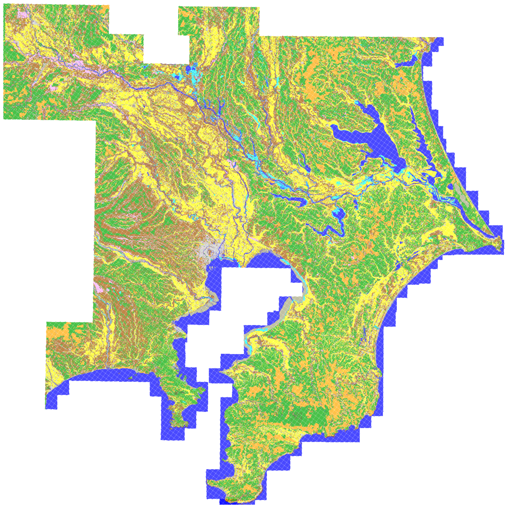

# 迅速測図土地利用データベース

##公開しているデータについて
本ページでは、[歴史的農業環境閲覧システム（HABS）](http://habs.dc.affrc.go.jp "HABS")上で公開している、迅速測図の幾何補正画像から作成した100m間隔の点形式土地利用データを公開しています。

現在公開中のデータは、1/20万地形図・水戸図郭に相当する範囲を、二次メッシュ毎にまとめたものです。データはGeoJSON形式になります。
各メッシュのデータを閲覧したい場合は、

http://wata909.github.io/habs_test/5440/rapid544000.html

といったアドレスにアクセスすることで閲覧可能です。

本データのライセンスは、[クリエイティブコモンズ　表示　4.0　国際](https://creativecommons.org/licenses/by/4.0/deed.ja "クリエイティブコモンズ　表示　4.0　国際") となります。

##注意事項
現在公開中のデータは、暫定版です。*データの精度検証は行われていません*ので、ご注意下さい。

##全データのイメージ

